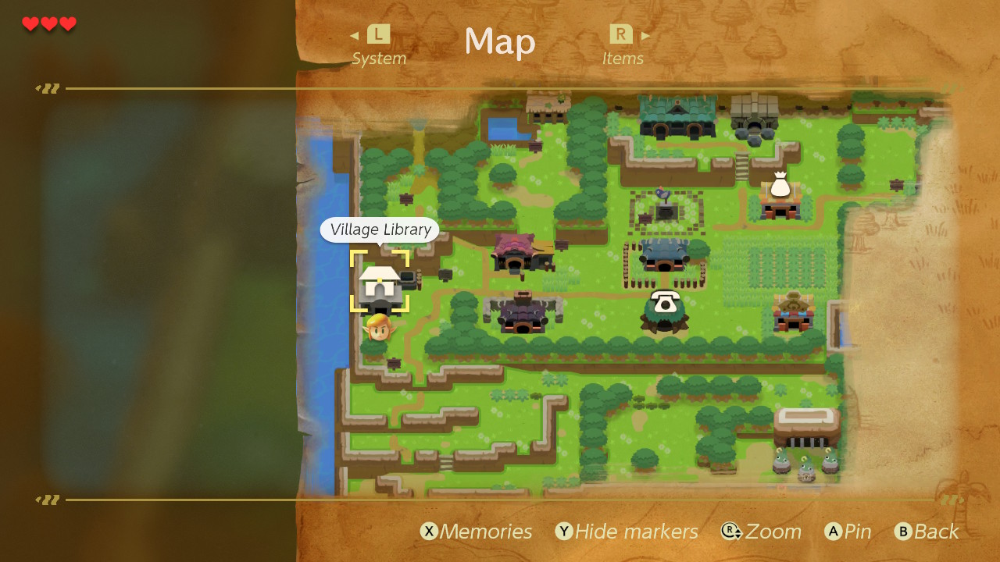
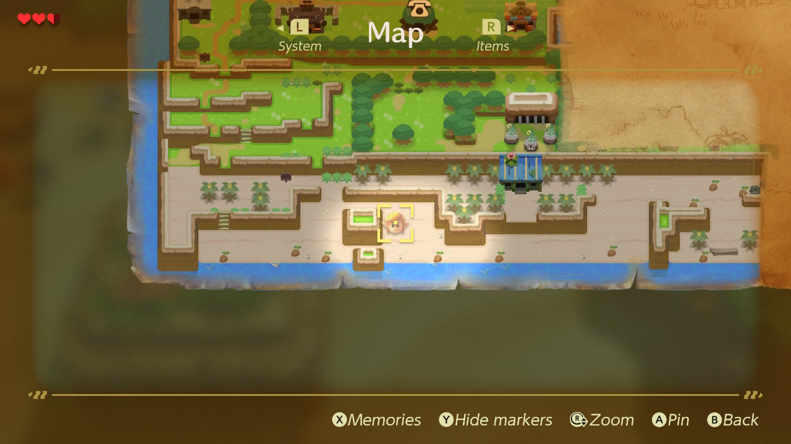

You can't get out of the village without the sword as you can't lift up the bushes.

# Show hint 1
Link's sword should be where he was found.

# Show hint 2
Marin (the girl next to your bed when you woke up) will tell you where you were.

# Tell vague location
The sword is in the beach.

# Show a hint about finding it
Go read a hint from the Village Library. Especially the book in the right top corner: "How to Handle Your Shiled Like a Pro!"

# Show how to find it
Go to the Toronob Shores (from the library, head down) and push one of the rightmost Sea Urchins *with your shield*. You find the sword near the coastline.

