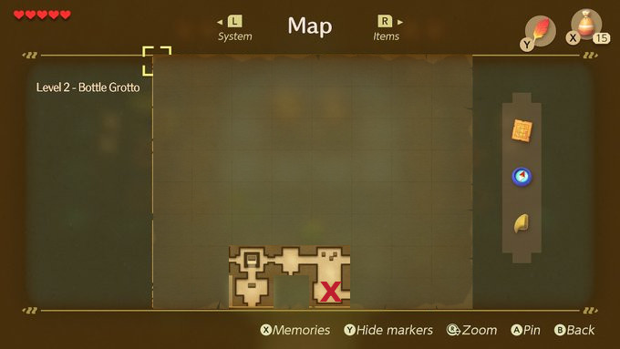

The Owl will tell you a hint how to get past the blue tiles. You need [the Stone Beak](../03-beak.md).

# Show hint 1
Hit the crystal with your sword to lower the blue tiles.

# Show hint 2
The orange tiles are now raised. Stand in the corner of the blocks and hit the other crystal. You can now access the chest that has a small key.
